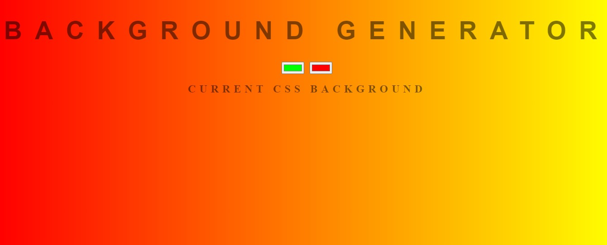

# Background-Generator
A Background generator tool used for creating and selecting nice line gradients.

## Table of contents

- [Overview](#overview)
  - [Screenshot](#screenshot)
  - [Links](#links)
  - [Built with](#built-with)

## Overview
A Background generator tool used for creating and selecting nice linear gradients. This task was created as part of the advanced javascript part 1 course on the complete web developer in 2023 by Zero to mastery. In the course of the task, i learnt how to manipulate the DOM using:
-getElementByTagName
-getElementByClassName
-getElementById
-querySelector
-querySelectorAll etc and all adding event listeners.

### Screenshot

### Links

- Solution URL: [CLICK ME]()
- Live Site URL: [CLICK ME]()

### Built with

- HTML5
- CSS
- JavaScript# Background-Generator
